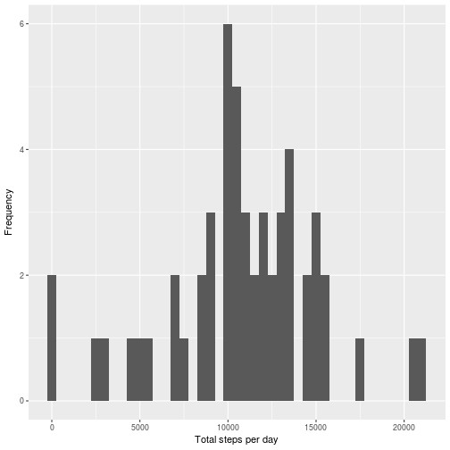
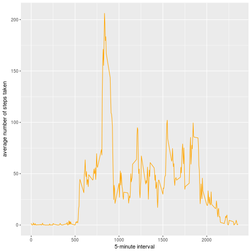
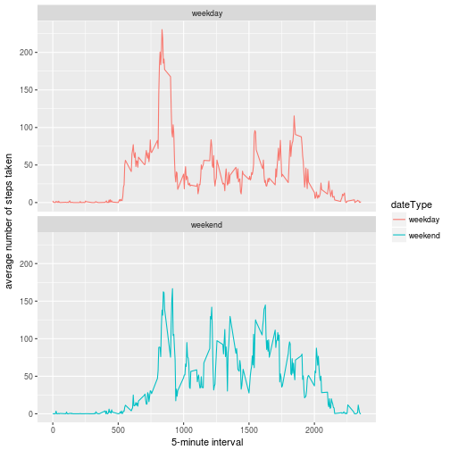

# Reproducible Research: Peer Assessment 1


## Loading and preprocessing the data
##### 1. Load the data (i.e. read.csv())

```r
if(!file.exists('activity.csv')){
    unzip('activity.zip')
}
df <- read.csv('activity.csv')
```

-----

## What is mean total number of steps taken per day?

```r
mdf=aggregate(steps~date,sum,data=df,na.action = na.omit)
```

##### 1. Make a histogram of the total number of steps taken each day

```r
qplot(mdf$steps,binwidth=500,xlab='Total steps per day',ylab='Frequency')
```



##### 2. Calculate and report the mean and median total number of steps taken per day

```r
stepsByDayMean <- mean(mdf$steps)
stepsByDayMedian <- median(mdf$steps)
```
* Mean: 1.0766189 &times; 10<sup>4</sup>
* Median:  10765

-----

## What is the average daily activity pattern?

```r
imdf<-aggregate(steps~interval,mean,data=df,na.rm=TRUE)
```

##### 1. Make a time series plot

```r
ggplot(data=imdf, aes(x=interval, y=steps)) +
    geom_line(color='orange') +
    xlab("5-minute interval") +
    ylab("average number of steps taken")  
```



##### 2. Which 5-minute interval, on average across all the days in the dataset, contains the maximum number of steps?

```r
timeMostSteps<-imdf[which.max(imdf$steps),1]
```

* Most Steps at: 835

----


## Imputing missing values
##### 1. Calculate and report the total number of missing values in the dataset 

```r
numMissingValues <- length(which(is.na(df$steps)))
```

* Number of missing values: 2304

##### 2. Create a new dataset that is equal to the original dataset but with the missing data filled in.

```r
df[is.na(df$steps)==TRUE,]$steps = imdf$steps[match(imdf$interval,df$interval)]
```


##### 3. Make a histogram of the total number of steps taken each day 

```r
mdfi=aggregate(steps~date,sum,data=df)

qplot(mdf$steps,binwidth=500,xlab='Total steps per day',ylab='Frequency')
```


##### ... and Calculate and report the mean and median total number of steps taken per day. 

```r
stepsByDayMeanImputed <- mean(mdfi$steps)
stepsByDayMedianImputed <- median(mdfi$steps)
```
* Mean (Imputed): 1.0766189 &times; 10<sup>4</sup>
* Median (Imputed):  1.0766189 &times; 10<sup>4</sup>


----

## Are there differences in activity patterns between weekdays and weekends?
##### 1. Create a new factor variable in the dataset with two levels – “weekday” and “weekend” indicating whether a given date is a weekday or weekend day.


```r
df$dateType <-  ifelse(as.POSIXlt(df$date)$wday %in% c(0,6), 'weekend', 'weekday')
```

##### 2. Make a panel plot containing a time series plot


```r
imdfi<-aggregate(steps~interval+dateType,mean,data=df,na.rm=TRUE)
ggplot(data=imdfi, aes(x=interval, y=steps,color=dateType)) +
    geom_line() +
    xlab("5-minute interval") +
    ylab("average number of steps taken")+facet_wrap(~dateType, ncol = 1, nrow=2)
```




